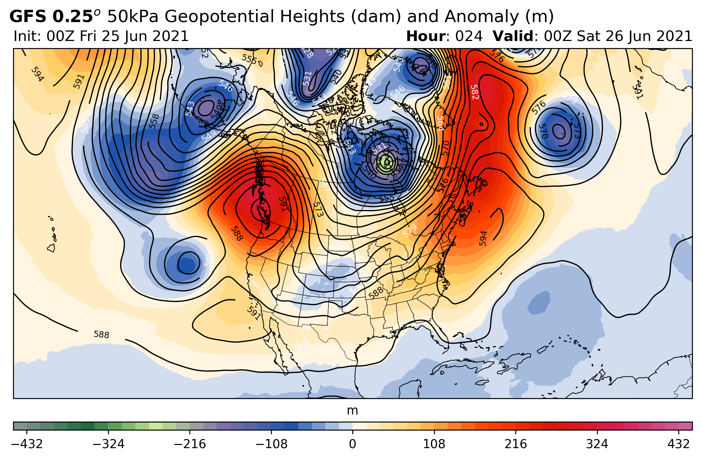

# ATSC 413 Forest-fire Weather and Climate

The ATSC413 repo downloads archived numerical weather prediction (NWP) model output and generates a sweep of forecast products. The forecast products will aid in teaching a fourth-year synoptic fire weather meteorology course at the University of British Columbia, where students will forecast fire weather conditions of past wildfire events.

## Forecast Products

The repo currently creates forecast maps centered over a specified region.

Products include:
- 25kPa Geopotential Heights (dam) and Wind Speed (knots)
- 50kPa Geopotential Heights (dam) and Anomaly (m)
- 3-h Precip (mm), MSLP (hPa), 100-50kPa Thickness (dam)
- 70kPa Relative Humidity (%)
- 3-hr Precipitation (mm)
- 2m Relative Humidity (%)
- 2m Temperature (C)
- Wind Speed and Direction at varied heights
- Surface-based CAPE (J/kg)

Sample Product:
- 50kPa Geopotential Heights (dam) and Anomaly (m)

    


## Data

NWP data is downloaded from the [Research Data Archive (RDA)](https://rda.ucar.edu/) manged by the [National Center for Atmospheric Research (NCAR)](https://ncar.ucar.edu/).


## Set up

Currently you need to clone the gitrepo to your machine

```
git clone git@github.com:cerodell/atsc413.git
```

Create conda env from `environment.yml`
```
conda env create -f environment.yml

```
Download climatology and road data from [google drive](https://drive.google.com/drive/folders/1QDcrmuP-GM3Gm63PlNUsy_aKgnB37j78?usp=share_link
) and place in `atsc413/data/`.

- This data is used for create anomaly forecast products and for plotting roads on basemaps.


## Download and Generate Forecasts Maps

There are two steps to download NWP data and generate forecast products.

1)  one needs to first add a case study to the `atsc413/json/case-attrs.json`.

    An example json configuration for a case study named, high level.
    ```
    {
    "high_level":{
        "loc": [58.305, -117.2924],
        "doi": ["2019-05-20", "2019-05-22"],
        "model": "gfs",
        "init": "00",
        "freq": 3
    }
    }
    ```
    - `"high_level"` is the name of the case study
    - `"loc":` is the lat and long
    - `"doi":` is the date of interest
    - `"model":` the abbreviation of the nwp model, currently only works for the nam and gfs
    - `"init":` the initializing time of the model run
    - `"freq":` the frequency of the forecast output

2)  After adding case study to the `atsc413/json/case-attrs.json`, edit the `case_study` variable in `atsc413/scripts/supervisor.py` and run `supervisor.py`.

    Running `supervisor.py` will download the data and generate the forecast graphics. NOTE if data was previously   downloaded, it will not re-download.
